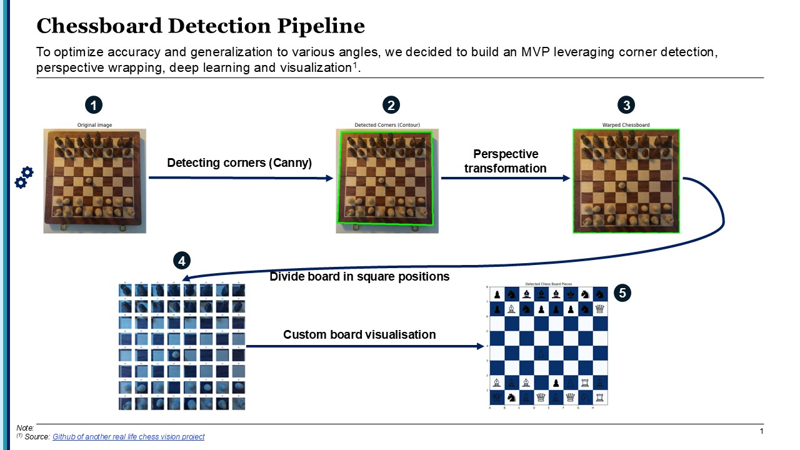
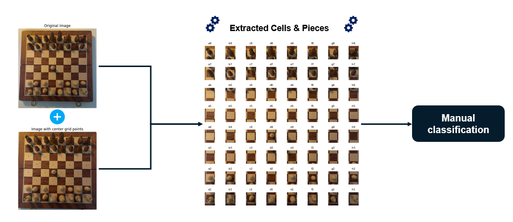

# Chess Computer Vision Project

  
  

## Objective
Develop a computer vision system capable of recognizing a chessboard, detecting pieces, and tracking moves from an image or a video stream. The project will utilize OpenCV and machine learning techniques to identify and reconstruct a chess game.

This project is being developed as part of my CentraleSupélec Computer Vision coursework.

## Scope
- **Input:** Chessboard image or video feed.
- **Output:** FEN (Forsyth–Edwards Notation) or move list.

### Constraints:
- Fixed camera angle (top-down view preferred).
- Standard chess pieces.
- Standard board (8x8 grid, alternating colors).

## Methodology
The approach follows the methodology described in the article **"Computer Vision System for Chess Game Reconstruction"** by M. Piškorec et al.

MVP pipeline

### Step-by-step Process

**Step 1: Preprocessing the Image**
Convert to Grayscale: Simplifies processing and reduces noise.
Apply Gaussian Blur: Smooths the image and reduces high-frequency noise.
Edge Detection: Use Canny or Sobel to detect edges.
Morphological Transformations: Apply dilation and erosion to clean up the edges.

**Step 2: Chessboard Detection**
Detect Chessboard Corners: Use OpenCV’s cv2.findChessboardCorners or Hough Line Transform to detect the grid.
Perspective Transformation: Warp the image so that the chessboard is aligned with a standard 8×8 grid.

**Step 3: Grid Segmentation (Splitting the Board into 64 Squares)**
Use the detected corners to map the chessboard into 64 individual squares.
Store each square as a ROI (Region of Interest).

**Step 4: Identifying Chess Pieces Using Dino-v2**
Extract each square that contains a piece.
Apply Dino-v2 (Vision Transformer model) to classify the piece.
Use a fine-tuned Dino-v2 model trained on chess piece datasets to detect:
Piece Type (King, Queen, Rook, Bishop, Knight, Pawn)
Piece Color (White/Black)

**Step 5: Mapping Positions to Chess Notation**
Assign the detected pieces to their corresponding chessboard positions (e.g., e4, d5).
Store the board state in FEN notation.

**Final Output**
Board State Representation: Generate FEN notation or a visual board with piece positions.

## Technologies Used
- **Programming Language:** Python (OpenCV, NumPy, TensorFlow/Keras for machine learning models)
- **Computer Vision:** OpenCV (for board and piece recognition)
- **Machine Learning:** SVM (Support Vector Machine) for classification OR dino-v2 for better performances
- **Data Formats:** FEN notation for chess state representation (or a list?)

## Dataset
Annoation pipeline used to create the custom dataset (to better match our chess board and pieces)

## Reference
Piškorec, M., Antulov-Fantulin, N., Ćurić, J., Dragoljević, O., Ivanac, V., & Karlović, L. (2010). **Computer Vision System for the Chess Game Reconstruction.** Faculty of Electrical Engineering and Computing, University of Zagreb.

## Future Enhancements
- Implement Deep Learning (CNN) for improved piece classification.
- Add support for real-time tracking with webcam input.
- Enhance robustness against varying lighting conditions and occlusions.

## License
This project is open-source and available under the MIT License.

---

### Contributors
- **[Louis Lhotte]**
- **[Paul-Alexandre Marenghi]**

For any queries or contributions, feel free to open an issue or submit a pull request!
